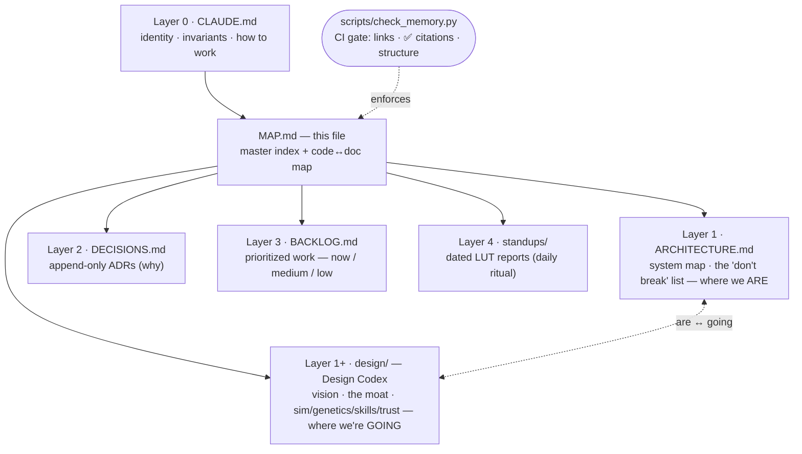

# 🗺️ Memory Map — the master index

> The single navigable map of GROWv2's memory system: how the layers fit, which **code** each
> design doc describes, and the live **build state** of the vision. When you land here cold, read
> top-to-bottom. Capability tags everywhere: ✅ built · 🔨 partial · ⬜ planned. This map is
> enforced — `scripts/check_memory.py` fails CI if a link breaks, a ✅ claim cites a missing path,
> or the codex falls out of the layer map.

## The layers at a glance

| Layer | File | Role | Volatility |
|------|------|------|-----------|
| 0 | `CLAUDE.md` | Always-loaded identity + invariants + how to work | Low |
| — | `docs/memory/MAP.md` | This master index: layer map + code↔doc + build state | Low |
| — | `docs/memory/CANONICAL_STATE.md` | Records-Department source of truth: PR / Branch / Directive ledgers + launch Critical Path + Department Status (refreshed per reconciliation sweep) | Snapshot |
| — | `docs/STUDIO_AGENT_REGISTRY.md` | Live cross-agent coordination (REC-003): branch/PR ownership, file-surface claims, collision log, rebase/serialization rules | Live |
| — | `docs/AGENT_ORCHESTRATION_LEDGER.md` | Agent orchestration (REC-004): employee/sub-agent roster, `SA-XXX` audit numbering, max-10 self-deployment cap, Work Order log | Live |
| 1 | `docs/memory/ARCHITECTURE.md` | System map + the "don't break" list (where we are) | Low |
| 1+ | `docs/memory/design/` | **Design Codex** — vision/intent (where we're going) | Low |
| 2 | `docs/memory/DECISIONS.md` | Append-only "why" log (ADRs) | Append-only |
| 3 | `docs/memory/BACKLOG.md` | Prioritized work — now / medium / low | High |
| 4 | `docs/memory/standups/` | Dated LUT round-table reports | Daily |

Read **top-down** (Layer 0 is short + stable; each layer down is more detailed + volatile). Write
**bottom-up** (facts land in a standup/backlog; permanent truth gets promoted into ARCHITECTURE /
CLAUDE, with the *why* in DECISIONS). ARCHITECTURE and the Codex are siblings: one is "where we
are," the other "where we're going."

## Code ↔ doc index
Each Design Codex doc, the concrete code it describes, and that code's state today. Paths are
repo-relative (under `src/growpodempire/` unless noted); every ✅ here is checked by
`scripts/check_memory.py`.

| Codex doc | Primary code it maps to | State today |
|-----------|-------------------------|-------------|
| `design/00-game-vision.md` | cross-cutting — see the moat/pillar dashboard below | mixed |
| `design/01-simulation-horticulture.md` | `simulation/engine.py` · `simulation/horticulture.py` · `simulation/curing.py` · `simulation/reactions.py` · `data/balance.yaml` (`simulation:`) | 🔨 Phase A done |
| `design/02-genetics.md` | `genetics/traits.py` · `genetics/breeding.py` · `data/strains.yaml` · `data/strain_knowledge.yaml` · `services/game_service.py` (breed/stabilize/verify/knowledge) | 🔨 14-trait core; 29-strain KB |
| `design/03-grower-skills.md` | `services/leveling_service.py` · `services/research_service.py` · `services/progression_service.py` · `data/balance.yaml` (`research`/`leveling`) | 🔨 no skill trees yet |
| `design/04-honesty-and-trust.md` | `simulation/engine.py` (`_rng_for`) · `services/game_service.py` (`verify_strain`) · `api/game_api.py` (`/provenance`) · `economy/ledger.py` · `services/advisor_service.py` | 🔨 fairness shipped for breeding |
| `design/05-events-and-competition.md` | `services/cup_service.py` · `economy/pricing.py` (`cup_score`) · `data/balance.yaml` (`cannabis_cup`) · `db/models.py` (`CannabisCup`/`CupEntry`) · `api/game_api.py` (`/cup/*`) | ✅ seasonal Cup + lifetime rewards |
| `design/06-university.md` | `services/university_service.py` · `services/lecturer_service.py` · `data/curriculum.yaml` · `ai/lecturer_mock.py`/`lecturer_claude.py` · `db/models.py` (`CourseEnrollment`/`DegreeProgress`) · `api/game_api.py` (`/university/*`) | ✅ degrees + AI Professor |
| `design/07-university-phase-2.md` | extends `06` — `services/university_service.py` · `services/lecturer_service.py` · `ai/provider.py` · `simulation/engine.py` (lab teaching-mode) · `web/src/app/university/` + `web/src/components/ui/`; long-form courses, labs, exams, narrated audio (greenfield) | ⬜ research/spec (UNI-001 v2) |

**What the sim engine actually reads today** (`simulation/engine.py`): water, nutrient (single
scalar), temperature, humidity, pH, **light (PPFD)**, **derived leaf VPD**, pest & disease levels;
genes consumed = `flowering_time`, `pest_resistance`, `disease_resistance` only. Everything richer
(photosynthesis, transpiration, EC/ions, spectrum/photoperiod, the other 11 genes) is 🔨/⬜ — see
`design/01-simulation-horticulture.md`.

## The moat — build-state dashboard
The seven differentiators from `design/00-game-vision.md`, mapped to where they're real.

| # | Moat differentiator | Today | Anchor in code |
|---|---------------------|-------|----------------|
| 1 | Real plant-physiology engine, not a timer | 🔨 Phase A | `simulation/engine.py`, `simulation/horticulture.py` |
| 2 | Generative, provably-unique genetics | 🔨 14-trait | `genetics/breeding.py` |
| 3 | Proof-of-Cultivation (seed ✅ + verify ✅; on-chain ⬜) | 🔨 | `services/game_service.py`, `db/models.py` |
| 4 | The GenBank (verifiable shared pedigree) | 🔨 | `services/game_service.py` (`verify_lineage`) + `GET /strains/<id>/lineage`; on-chain settlement ⬜ |
| 5 | Discovery economy (first-finder credit) | 🔨 | seasonal Cannabis Cup — `services/cup_service.py` (lifetime trophy strain + Hall of Fame) |
| 6 | Mastery + time as the gate / anti-whale | 🔨 | `services/leveling_service.py`, `services/research_service.py` |
| 7 | AI Master Grower data flywheel | 🔨 | `services/advisor_service.py`, `services/autocare_service.py` |

Mastery (#6) now has two earned axes shipped: the spend-based research tree **and** **GrowPod
University** (`services/university_service.py`) — time + practical study → degrees that grant
permanent perks + a title, taught by an AI Professor (`services/lecturer_service.py`).

The five player-facing pillars: **The Grow** 🔨 · **The Genetics** 🔨 · **The Mastery** 🔨 ·
**The Economy** ✅ (`economy/ledger.py`, `economy/pricing.py`) · **The Chain** 🔨 (provider ABC + mock
real; TestNet/IPFS deferred — Sprint 4).

## Verification map — how "known-good" is enforced
What stops each area from silently breaking. Tags: 🧪 **test-backed** (CI fails if it regresses) ·
📌 **hash-pinned** (source-contract pins; currently hand-run, CI-enforced once vitest lands —
RISK #8) · 👁 **eye-audited** (a human/agent read it carefully on the date shown — **rots on the
next edit**, counts for far less than 🧪) · ⬜ **unverified**.

| Area | Code | Verified by | Depth |
|------|------|-------------|-------|
| Money / ledger | `economy/ledger.py`, `economy/pricing.py` | `tests/test_economy.py` + invariant suite `tests/test_properties.py` + `tests/test_concurrency.py` (double-spend, CHECK floor, harvest-once) | 🧪 strong |
| Genetics / provenance | `genetics/` | `tests/test_genetics.py`, `tests/test_properties.py`, `tests/test_provenance.py`, `tests/test_stabilization.py` | 🧪 strong |
| Simulation | `simulation/` | `tests/test_simulation.py` (incl. dormancy convergence + parity), `tests/test_horticulture.py`, `tests/test_curing.py` | 🧪 — dormancy *semantics* still a design risk (#9) |
| API auth / security | `api/` | `tests/test_security.py` (18: auth, IDOR, rate-limit, validation), `tests/test_auth.py`, `tests/test_errors.py` | 🧪 |
| Game services (cup, university, shop, research, …) | `services/` | per-service suites — `tests/test_cup.py`, `tests/test_university.py`, `tests/test_research.py`, `tests/test_shop.py`, etc. (35 files, 197 tests, coverage gate 80%) | 🧪 |
| Chain / settlement | `chain/`, `services/settlement_service.py`, `services/minting_service.py` | `tests/test_chain.py`, `tests/test_settlement.py`, `tests/test_minting.py` — mock-provider paths only; the **deposit trust gap is untested** (RISK #7) | 🧪 shallow |
| Web: Constellation render core | `web/src/components/viz/Constellation.tsx` | 📌 sacred sha256 pins in `web/src/components/viz/__tests__/constellationLifecycle.test.ts` + listener/RAF contracts; hand-verified 2026-06-11 (4×) | 📌 — needs vitest in CI to become 🧪 |
| Web: everything else | `web/src/` | 👁 helper review + independent audit, 2026-06-11 (`docs/audits/PR-15-grovers-leaf.md`) | 👁 → ⬜ as it's edited (RISK #8) |
| Memory docs | `docs/memory/` | `scripts/check_memory.py` in CI (links, ✅ citations, layer map) | 🧪 |

**The rule:** when something is verified for real, the proof lands as a **test or pin** (and the
row here flips to 🧪/📌) — never as a "checked this" comment in code; those rot silently and then
lie. An 👁 entry must carry its date and is treated as expired once the file changes. The goal
state isn't "the whole codebase read twice" — it's this table all-🧪 on the paths that matter,
so correctness is *re-proven on every push* instead of remembered.

## Surface area (anchors, not exhaustive)
- **API:** ~52 routes under `/api/game` in `api/game_api.py` (writes auth'd + rate-limited; reads
  public). Trust surface: public `GET /strains/<id>/provenance` replays a cross to prove its genome,
  and `GET /strains/<id>/lineage` replays the whole ancestry back to base-catalog roots. Competition
  surface: `GET /cup/current`, `/cup/<id>/standings`, `/cup/hall-of-fame`, `POST .../cup/enter`.
  University surface: `GET /university/catalog`, `GET /players/<id>/university`, `POST
  .../courses/<key>/{enroll,complete}`, `POST /players/<id>/degrees/<key>/claim`, `GET
  .../courses/<key>/lecture`.
- **Strain knowledge base:** `data/strain_knowledge.yaml` — a scientist-grade encyclopedia (lineage,
  origin, cannabinoid/terpene detail, cultivation parameters) for all 29 catalog strains, surfaced at
  public `GET /strains/<id>/knowledge`. A test enforces 1:1 sync between the catalog and the KB. It's
  grounded by a peer-reviewed research reference:
  `docs/research/2026-06-08-cannabis-strain-genetics-and-cultivation.md` (a 5-agent deep-research
  campaign; the source of the KB's name-unreliability + THC-inflation caveats).
- **Not yet in the Codex** (covered only by ARCHITECTURE/standups, intentionally — gameplay, not
  moat): `services/contract_service.py`, `services/leaderboard_service.py`,
  `services/weather_service.py`, `services/minting_service.py`, `services/settlement_service.py`,
  and the marketplace/auction, shop, and Phase-3 wallet/mint endpoints.

## Maintaining this map
1. **It's enforced.** `make check-memory` (CI runs it every push) fails on broken internal links,
   a ✅ claim that cites a missing path, or a missing/unreferenced required memory file. Keep it green.
2. **Tags are honest.** When a 🔨/⬜ ships, flip its tag here *and* in its codex doc in the same
   change; if it moved an invariant, update `ARCHITECTURE.md` / `CLAUDE.md` too.
3. **This is the canonical layer map.** Other files (CLAUDE.md, the codex README) summarize it;
   when they disagree, this file wins — and the layer-map table here is the one to update first.
4. **Don't let it sprawl.** It's an index + dashboard, not prose. Deep detail lives in the layer it
   points at.

## Product / planning docs (`docs/product/`)
Forward-looking product/economy/UI planning (status-labeled `live | in-progress | placeholder |
planned | not-wired`; nothing claimed live without a real path). Build only after the owner
decisions listed in the roadmap.

| Doc | Scope |
|-----|-------|
| `docs/product/GROWVERSE_UI_FEATURE_BUILDS.md` | 10 UI feature lanes (onboarding, grow board, guide, notifications, suggestions, journal, persona, market feedback, tester status, mobile dashboard) |
| `docs/product/GROWVERSE_OPTIONAL_BOOST_ECONOMY.md` | Optional, free-in-alpha paid boost/recovery concept (all `planned`) |
| `docs/product/GROWVERSE_LIQUIDITY_TRANSPARENCY_MODEL.md` | USD/approx-ALGO pricing + liquidity-first allocation models A/B/C + public copy |
| `docs/product/GROWVERSE_FAIRNESS_GUARDRAILS.md` | Pay-to-win prevention, caps, Cup rules, boosted-plant labeling |
| `docs/product/GROWVERSE_BOOST_UI_COPY.md` | Paste-ready button/modal/receipt/QA copy |
| `docs/product/GROWVERSE_BUILD_PRIORITY_ROADMAP.md` | Phased order + risks/legal notes + top-5 owner decisions |
