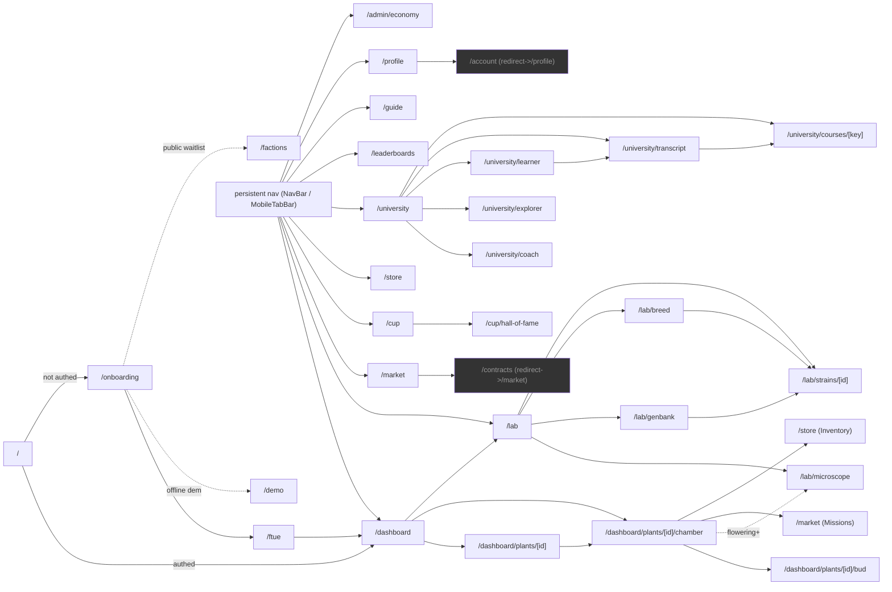

# 🗺️ UI Audit Map — every screen, every button, tracked to completion

> **Purpose.** A complete inventory of every route and every interactive control in the web
> client, with a wiring-correctness status per control. This is the tracking artifact for an
> ongoing, self-paced audit loop (owner directive 2026-07-03): go through every menu and every
> button, confirm each one is actually wired to real, working behavior (not a dead handler, not
> a cosmetic-only control masquerading as a real action), and keep this map current until every
> row reads ✅.
>
> **How to use this doc (for the audit loop, each iteration):**
> 1. Read the Progress Summary below — find the route with the most 🔲 rows.
> 2. Read that route's table. For each 🔲 row: find the button's handler in the component file,
>    confirm the handler calls a real `api.*` client method (not a stub), confirm that client
>    method hits a real backend route (`grep` the Flask blueprint), and — for the highest-traffic
>    routes — actually click it via a running dev server / Playwright to see the real effect.
> 3. Flip the row to ✅ (confirmed correct), ⚠️ (works but has a real issue — file it in
>    `BACKLOG.md` and link it here), or ❌ (dead/broken — same, file + link).
> 4. Update the Progress Summary counts. Commit.
> 5. When every row across every route is ✅ or has a filed, linked BACKLOG item, the loop is
>    complete — update the banner below and stop scheduling further wake-ups.
>
> **Legend:** ✅ verified correct · ⚠️ flagged, needs a fix (see note) · ❌ confirmed dead/broken ·
> 🔲 not yet audited

**Loop status: 🔲 IN PROGRESS** — seeded 2026-07-03 from a full source-level inventory pass
(component tree read directly, not guessed from filenames). Zero routes fully verified yet;
two real issues already surfaced by the inventory pass itself (see Known Issues below) before
any active-click verification began.

---

## Progress summary

| Route | Controls | ✅ | ⚠️ | ❌ | 🔲 |
|---|---|---|---|---|---|
| `/` | 0 (pure redirect) | — | — | — | — |
| `/onboarding` | 6 | 0 | 0 | 0 | 6 |
| `/ftue` | 3 | 0 | 0 | 0 | 3 |
| `/dashboard` | ~24 | 0 | 0 | 0 | 24 |
| `/dashboard/plants/[id]` | 12 | 0 | 0 | 0 | 12 |
| `/dashboard/plants/[id]/chamber` | 17 | 0 | 2 | 0 | 15 |
| `/dashboard/plants/[id]/command` | 0 (pure redirect) | — | — | — | — |
| `/dashboard/plants/[id]/bud` | 2 | 0 | 0 | 0 | 2 |
| `/lab` | 6 | 0 | 0 | 0 | 6 |
| `/lab/breed` | 4 | 0 | 0 | 0 | 4 |
| `/lab/genbank` | 2 | 0 | 0 | 0 | 2 |
| `/lab/strains/[id]` | 5 | 0 | 0 | 0 | 5 |
| `/store` | 13 | 0 | 0 | 0 | 13 |
| `/market` | 7 | 0 | 0 | 0 | 7 |
| `/contracts` | 0 (pure redirect) | — | — | — | — |
| `/cup` | 2 | 0 | 0 | 0 | 2 |
| `/cup/hall-of-fame` | 2 | 0 | 0 | 0 | 2 |
| `/university` | 6 | 0 | 0 | 0 | 6 |
| `/university/coach` | 2 | 0 | 0 | 0 | 2 |
| `/university/explorer` | 6 | 0 | 0 | 0 | 6 |
| `/university/learner` | 7 | 0 | 0 | 0 | 7 |
| `/university/transcript` | 3 | 0 | 0 | 0 | 3 |
| `/university/courses/[key]` | 8 | 0 | 0 | 0 | 8 |
| `/profile` | 10 | 0 | 1 | 0 | 9 |
| `/account` | 0 (pure redirect) | — | — | — | — |
| `/leaderboards` | 1 | 0 | 0 | 0 | 1 |
| `/guide` | 3 | 0 | 0 | 0 | 3 |
| `/mission` | 1 | 0 | 0 | 0 | 1 |
| `/factions` | 3 | 0 | 0 | 0 | 3 |
| `/admin/economy` | 10 | 0 | 0 | 0 | 10 |
| `/demo` | 9 | 0 | 0 | 0 | 9 |
| **Total** | **~172** | **0** | **3** | **0** | **~169** |

*(Dev-only `/dev/morphology` and `/dev/plant-review` are excluded — never reachable in a
production build, not part of the player-facing surface.)*

---

## Known issues (surfaced by the inventory pass itself, before active verification)

1. ⚠️ **Chamber `AIRFLOW (fan)` slider is cosmetic-only, never persisted** —
   `web/src/components/plant/InsightsPanel.tsx`'s Environment panel has a fan/airflow nudge
   control that doesn't call any API — it's inert. This is now a real functional gap, not just
   a UI nit: fans got a genuine simulation effect this session (condition-scaled humidity
   reduction feeding mold/mildew risk — `simulation/engine.py::_equipped_condition_effects`),
   so a player-facing airflow control that doesn't actually equip/affect a fan is actively
   misleading. **Fix path:** either wire it to `GameService.equip_fan` (the real endpoint added
   this session, `POST /players/<id>/pods/<pod_id>/equip-fan`) or remove the control until it's
   wired — a fake knob is worse than no knob.
2. ⚠️ **"🏆 Enter Cup" button on `HarvestCard` is an unwired optional prop** —
   `web/src/components/profile/HarvestsPanel.tsx` — the callback prop exists but `/profile`
   doesn't pass a handler, so the button either renders inert or isn't rendered at all
   (needs the active-verification pass to confirm which). Real Cup entry only works from
   `/cup`'s own "Enter a harvest" modal today.
3. ⚠️ **Store page bypasses the typed `api.*` client for 3 sections** — Seeds, Consumables, and
   Research sections in `web/src/app/store/page.tsx` call raw `apiFetch` POSTs to REST paths
   directly instead of going through `lib/api/store.ts` like every other section on the same
   page. Not necessarily broken, but an inconsistency worth normalizing — flag for the
   `/store` audit pass to confirm these raw calls are actually correct (right method, right
   path, right auth) before deciding whether to leave as-is or refactor into the typed client.

---

## Navigation diagram

---

## Table of contents

- [`/` — Home (redirect)](#-home)
- [`/onboarding` — Cinematic landing / login](#onboarding)
- [`/ftue` — Guided first grow](#ftue)
- [`/dashboard` — Command Center](#dashboard)
- [`/dashboard/plants/[plantId]` — Plant detail](#dashboardplantsplantid)
- [`/dashboard/plants/[plantId]/chamber` — Grow Chamber](#dashboardplantsplantidchamber)
- [`/dashboard/plants/[plantId]/bud` — Bud Viewer](#dashboardplantsplantidbud)
- [`/lab` — Strain Lab](#lab)
- [`/lab/breed` — Breeding & Stabilization](#labbreed)
- [`/lab/genbank` — Cultivar Galaxy](#labgenbank)
- [`/lab/strains/[strainId]` — Strain detail](#labstrainsstrainid)
- [`/store` — Store](#store)
- [`/market` — Marketplace](#market)
- [`/cup` — Cannabis Cup](#cup)
- [`/cup/hall-of-fame`](#cuphall-of-fame)
- [`/university` — Course Catalog](#university)
- [`/university/coach`](#universitycoach)
- [`/university/explorer`](#universityexplorer)
- [`/university/learner`](#universitylearner)
- [`/university/transcript`](#universitytranscript)
- [`/university/courses/[key]`](#universitycourseskey)
- [`/profile` — Grower Profile](#profile)
- [`/leaderboards`](#leaderboards)
- [`/guide` — Grow Guide](#guide)
- [`/mission` — Mission Control (admin, not in nav)](#mission)
- [`/factions` — Waitlist (not in nav)](#factions)
- [`/admin/economy` — Token Economy Admin (not in nav)](#admineconomy)
- [`/demo` — Local offline demo](#demo)

---

## `/` — Home

Pure redirect (authed → `/dashboard`, else → `/onboarding`). Nothing to audit.

## `/onboarding`

File: `app/onboarding/page.tsx`

| Control | Wiring | Status | Note |
|---|---|---|---|
| Create account | `api.players.create(username, email)` | 🔲 | |
| Tab: New account / I have a key | local state only | 🔲 | |
| Sign in with Player ID + API key | `api.players.get(playerId, apiKey)` → `login()` → `/dashboard` | 🔲 | |
| ▶ Play Demo Grow (offline) | routes to `/demo` | 🔲 | |
| Copy key (post-creation) | clipboard, no API | 🔲 | |
| I've saved it — enter the game | `login()` → `/ftue` | 🔲 | |

## `/ftue`

File: `app/ftue/page.tsx`

| Control | Wiring | Status | Note |
|---|---|---|---|
| Primary step CTA (label varies) | `api.ftue.advance(playerId, step)` | 🔲 | |
| Skip → | local complete + route `/dashboard` | 🔲 | |
| Enter the game → (terminal) | same as Skip | 🔲 | |

## `/dashboard`

File: `app/dashboard/page.tsx` → `PodCommandCenter.tsx`

| Control | Wiring | Status | Note |
|---|---|---|---|
| Buy seeds | `Link` → `/lab` | 🔲 | |
| + New Pod → Create Pod | `api.pods.create(playerId, name, {tier, capacity})` | 🔲 | |
| Pod switcher tabs | local state | 🔲 | |
| Import plant by ID → Import | `usePlantImport` → `api.plants.state` | 🔲 | |
| ↻ Restart tutorial | resets onboarding tour state | 🔲 | |
| Dismiss long-absence banner | local only | 🔲 | |
| 🎁 Go to Profile / ✕ (token claim banner) | `Link` `/profile` or local dismiss | 🔲 | |
| Plant carousel ‹ › + tap select | local state | 🔲 | |
| 🕹 Arcade chip | `Link` → chamber | 🔲 | |
| 🌿 Whole plant / 🔬 View bud toggle | local state (WebGL) | 🔲 | |
| Plant a seed (seed + soil select) → 🌱 Plant here | `api.plants.plant(playerId, seedId, podId, soilKey)` | 🔲 | confirm soil param actually reaches backend post-this-session's soil feature |
| GrowthScrubber drag + Back to live | client-only preview | 🔲 | |
| ChamberActionBar: 💧 Water | `api.plants.water` | 🔲 | |
| ChamberActionBar: 🧪 Feed | `api.plants.feed` | 🔲 | |
| ChamberActionBar: ✂️ Prune | `api.plants.prune` | 🔲 | |
| ChamberActionBar: 🪢 Train | `api.plants.train` | 🔲 | |
| ChamberActionBar: 🔍 Inspect | `Link` to plant detail | 🔲 | |
| ChamberActionBar: ⚡ Boost | `api.plants.boost` | 🔲 | |
| ChamberPanel "Today's Plan" urgency chips | matching `api.plants.*` mutation | 🔲 | |
| ✂️ Harvest & Sell | `api.plants.harvest(playerId, plantId, {sell:true})` | 🔲 | |
| EnvironmentRail: 5 setpoint sliders + snap/nudge | debounced `api.pods.setEnvironment` | 🔲 | |
| ⚙ Advanced · Scientist view toggle | local UI | 🔲 | |
| Clean & recycle (ended plant) | `api.plants.cleanup` | 🔲 | |

## `/dashboard/plants/[plantId]`

File: `app/dashboard/plants/[plantId]/page.tsx`

| Control | Wiring | Status | Note |
|---|---|---|---|
| ← Back to dashboard / 🛰 Command Center / 🌿 Open Grow Chamber | `Link`s | 🔲 | |
| PlantActionCTA (resolved next-step button) | `api.plants.*` / `harvest` / `cleanup` | 🔲 | |
| CareButtons: Water/Feed/Treat Pests/Treat Disease/Prune/Train/Boost | `api.plants.*` | 🔲 | |
| 📓 Journal | anchor link, same page | 🔲 | |
| ✂️ Harvest & Sell | `api.plants.harvest(..., {sell:true})` | 🔲 | |
| ConsumablesPanel: Use (per item) | `useApplyConsumable` | 🔲 | |
| AdvisorPanel: Ask the grower / Re-diagnose | `api.advisor.get` | 🔲 | |
| AdvisorPanel: ⚡ Let the AI care for it | `api.advisor.autoCare(playerId, plantId, {budget, max_actions})` | 🔲 | |

## `/dashboard/plants/[plantId]/chamber`

File: `.../chamber/page.tsx`

| Control | Wiring | Status | Note |
|---|---|---|---|
| ← Back to plant | `Link` | 🔲 | |
| Bottom dock (Water/Feed/Prune/Train/Inspect/Boost) | `api.plants.*` | 🔲 | |
| 🔬 Inspect trichomes (flowering+) | `Link` `/lab/microscope?plantId=` | 🔲 | |
| Left panel Actions (Water/Feed/Prune/Train/Boost + Inspect link) | `api.plants.*` | 🔲 | |
| Right panel: Environment sliders | `api.pods.setEnvironment` | 🔲 | |
| **Right panel: AIRFLOW (fan) slider** | **none — cosmetic only** | ⚠️ | **CONFIRMED** — `onSlide()` explicitly skips `scheduleCommit` for `"fan"`. Filed in BACKLOG.md (Dormant investments). |
| Missions → Open contracts | `Link` `/contracts` → redirects `/market` | 🔲 | |
| Inventory → Open store | `Link` `/store` | 🔲 | |
| Arcade Boosts: 4 Quick Boost chips | client-only, no server call | 🔲 | confirm this is *intentionally* cosmetic (arcade juice) vs. a gap |
| Arcade Boosts: ⚡ Boost Growth · 60 🌿 | `api.plants.growthBoost` | 🔲 | |
| Preview Growth scrub + Back to live | client-only | 🔲 | |
| ArcadeHUD: Rewind | client-only | 🔲 | |
| ArcadeHUD: ChainRow mint/wallet (if ALGO enabled) | chain API | 🔲 | |
| Ended: 🌱 Grow another → | `useCleanupPlant` → `/dashboard` | 🔲 | |
| Ended: 📋 Harvest review / 🏆 Enter the Cup | `Link`s | 🔲 | |
| Ended: 📸 Save snapshot | client-only PNG download | 🔲 | |
| Ended: 🧹 Clean & recycle pod | cleanup mutation | 🔲 | |

## `/dashboard/plants/[plantId]/bud`

| Control | Wiring | Status | Note |
|---|---|---|---|
| ← Chamber / 🧪 Open Lab | `Link`s | 🔲 | |
| Drag/scroll orbit | camera only | 🔲 | |

## `/lab`

| Control | Wiring | Status | Note |
|---|---|---|---|
| 🔬 Microscope / ✦ GenBank / 🧬 Breeding | `Link`s | 🔲 | |
| Seasonal drop — Buy Seed | `api.seasonal.purchase` | 🔲 | |
| StrainFilters (search/rarity/lineage/catalog-only) | client-side filter | 🔲 | |
| Per strain: ☆ favorite toggle | `api.strains.addFavorite`/`removeFavorite` | 🔲 | |
| Per strain: Buy seed | `api.seeds.buy` | 🔲 | |
| Per strain: Mint NFT (stability ≥85%, rarity ≥rare) | `api.strains.mint` | 🔲 | |

## `/lab/breed`

| Control | Wiring | Status | Note |
|---|---|---|---|
| Parent A/B selects + name field | local | 🔲 | |
| 🧬 Breed (fee applies) | `api.breeding.breed` | 🔲 | |
| Open in Strain Lab → | `Link` | 🔲 | |
| Stabilize | `api.strains.stabilize` | 🔲 | |

## `/lab/genbank`

| Control | Wiring | Status | Note |
|---|---|---|---|
| ← Back to Lab | `Link` | 🔲 | |
| Click node → strain detail | routes to `/lab/strains/[id]` | 🔲 | |

## `/lab/strains/[strainId]`

| Control | Wiring | Status | Note |
|---|---|---|---|
| ← Back / Buy seed | `Link` / `api.seeds.buy` | 🔲 | |
| Tabs (Encyclopedia/3D/DNA/Lineage/Verify) | local | 🔲 | |
| Lineage tab ancestor links | `Link`s | 🔲 | |

## `/store`

| Control | Wiring | Status | Note |
|---|---|---|---|
| Featured/seasonal Buy | `api.seasonal.purchase` or raw `apiFetch` | 🔲 | see Known Issue #3 |
| Partner Drops: Buy | `api.store.purchasePartner` | 🔲 | |
| Gear: Buy / Equip / Service / Sell | `storeApi.purchaseGear/equipLight/equipFan/serviceGear/sellGear` | 🔲 | high priority — this session's new depreciation feature |
| Bundles: Buy Bundle | `api.store.purchaseBundle` | 🔲 | |
| Seeds: Buy Seed | raw `apiFetch` POST `/players/{id}/seeds/buy` | 🔲 | see Known Issue #3 |
| Consumables: Buy | raw `apiFetch` POST `/players/{id}/shop/buy` | 🔲 | see Known Issue #3 |
| Research: Unlock | raw `apiFetch` POST `/players/{id}/research/{key}/unlock` | 🔲 | see Known Issue #3 |

## `/market`

| Control | Wiring | Status | Note |
|---|---|---|---|
| Tabs: Fixed/Auctions/Contracts | local + flag-gated | 🔲 | |
| Create listing / Create auction | `api.market.createListing`/`createAuction` | 🔲 | |
| Buy (fixed) | `api.market.buy` | 🔲 | |
| Bid | `api.market.bid` | 🔲 | |
| Settle (auction) | `api.market.settle` | 🔲 | |
| Contracts: Request contract | `api.contracts.offer` | 🔲 | |
| Contracts: Fulfill | `api.contracts.fulfill` | 🔲 | |

## `/cup`

| Control | Wiring | Status | Note |
|---|---|---|---|
| ♛ Hall of Fame | `Link` | 🔲 | |
| 🏆 Enter a harvest → Enter | `api.cup.enter` | 🔲 | cross-check against Known Issue #2 |

## `/cup/hall-of-fame`

| Control | Wiring | Status | Note |
|---|---|---|---|
| ← Current Cup / champion strain link | `Link`s | 🔲 | |

## `/university`

| Control | Wiring | Status | Note |
|---|---|---|---|
| My Path / Coach / Explorer / Transcript nav | `Link`s | 🔲 | |
| Department filter chips | local | 🔲 | |
| Degree progress cards | `Link` | 🔲 | |
| Course card: Enroll | `api.university.enroll` | 🔲 | |
| Course card: Open | `Link` | 🔲 | |

## `/university/coach`

| Control | Wiring | Status | Note |
|---|---|---|---|
| Message input + Ask | `api.university.askMasterGrower` | 🔲 | |
| 🔊 Read aloud toggle | browser TTS, client-only | 🔲 | |

## `/university/explorer`

| Control | Wiring | Status | Note |
|---|---|---|---|
| Preset chips | local | 🔲 | |
| 5 range sliders + Reset | client-only WebGL | 🔲 | |

## `/university/learner`

| Control | Wiring | Status | Note |
|---|---|---|---|
| Take the intake quiz / radios / Get my learning path | `api.university.submitAdmissions` | 🔲 | |
| Retake / Cancel | local | 🔲 | |
| RoadmapPanel: 7-day/14-day toggle | re-queries `api.university.roadmap` | 🔲 | |

## `/university/transcript`

| Control | Wiring | Status | Note |
|---|---|---|---|
| Per degree: Claim degree | `api.university.claimDegree` | 🔲 | |
| Completed-course links | `Link` | 🔲 | |

## `/university/courses/[key]`

| Control | Wiring | Status | Note |
|---|---|---|---|
| Enroll | `api.university.enroll` | 🔲 | |
| 🔊 Listen/Pause narration | client-only TTS playback | 🔲 | |
| Attend lecture / Re-deliver | `api.university.lecture` | 🔲 | |
| Complete course | `api.university.complete` | 🔲 | |
| Exam: Start/Retry/Review/Close | local | 🔲 | |
| Exam: Submit answers | `api.university.submitExam` | 🔲 | |
| Exam: Try again | local reset | 🔲 | |

## `/profile`

| Control | Wiring | Status | Note |
|---|---|---|---|
| Sign out | `logout()` → `/onboarding` | 🔲 | |
| Claim daily stipend | `api.players.claimDaily` | 🔲 | |
| Connect/Disconnect wallet (if `chain` flag) | `api.wallet.link`/`unlink` | 🔲 | |
| **Stake GROW** | **permanently disabled placeholder** | ⚠️ | intentional pre-launch no-op — confirm copy is honest about "coming soon" |
| Medals: Claim [reward] | `api.players.claimAchievement` | 🔲 | |
| HarvestCard: Start cure / Finish cure / Sell / Mint | `api.harvests.*` | 🔲 | |
| **HarvestCard: 🏆 Enter Cup** | **prop not wired from this page** | ⚠️ | **CONFIRMED** — `<HarvestsPanel />` on `/profile` passes no `onEnterCup`; button never renders. Filed in BACKLOG.md (Dormant investments). |

## `/leaderboards`

| Control | Wiring | Status | Note |
|---|---|---|---|
| Board tabs (Richest/Level/Harvesters/Breeders) | re-queries `useLeaderboard` | 🔲 | |

## `/guide`

| Control | Wiring | Status | Note |
|---|---|---|---|
| Search input | client-side filter | 🔲 | |
| Section `
` expand | native, no API | 🔲 | |
| ← Back to your grow / ↻ Restart tutorial | `Link` / local | 🔲 | |

## `/mission`

Admin/owner-only, not in nav, build-flag gated. Entirely read-only telemetry except:

| Control | Wiring | Status | Note |
|---|---|---|---|
| Plant selector (if >1 plant) | local state | 🔲 | |

## `/factions`

Public pre-launch page, not in nav.

| Control | Wiring | Status | Note |
|---|---|---|---|
| Faction card click | local select | 🔲 | |
| Connect wallet | fills address field | 🔲 | |
| Join the waitlist | `api.waitlist.join` | 🔲 | |

## `/admin/economy`

Admin console, not in nav.

| Control | Wiring | Status | Note |
|---|---|---|---|
| Re-seed from live data | re-derives local state, no mutation | 🔲 | |
| 8 economy-projector sliders | client-only what-if model | 🔲 | |
| Seasonal drops: Roll → Next Month / Add-Update / Remove | admin REST calls | 🔲 | |
| Store partners: Add / Active toggle / Remove | admin REST calls | 🔲 | |
| Featured items: Pin / Unpin | admin REST calls | 🔲 | |

## `/demo`

Fully offline, `localStorage`-backed, no API — audit is "does the local reducer actually do
what the button says," not backend wiring.

| Control | Wiring | Status | Note |
|---|---|---|---|
| Strain pick buttons | `startDemo` | 🔲 | |
| 💧 Water / 🌱 Feed / 💡 Light toggle / 🔍 Inspect | local reducers | 🔲 | |
| ⏭ Advance Day / Save / Reset demo | local reducers | 🔲 | |
| Use real cloud login instead → | `Link` `/onboarding` | 🔲 | |

---

## Retired routes (redirect-only, no controls to audit)

`/` (redirect), `/contracts` → `/market`, `/account` → `/profile`,
`/dashboard/plants/[id]/command` → `/dashboard`.

## Excluded from player-facing audit

`/dev/morphology`, `/dev/plant-review` — `notFound()`-gated to development builds only, never
reachable in production. Flagged for completeness, not tracked in the progress summary.
