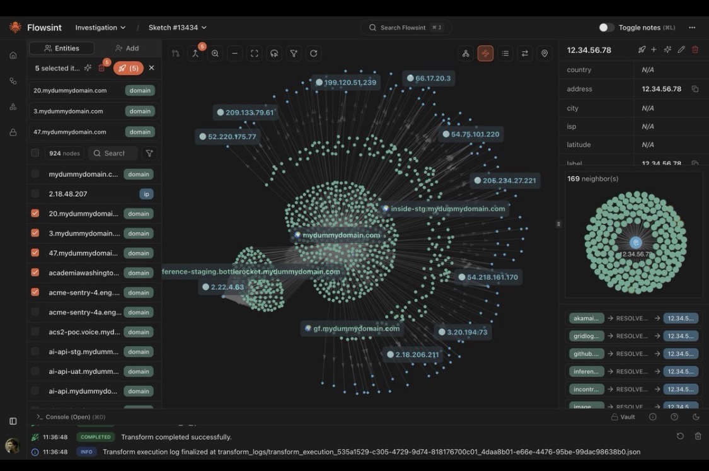

# 🌍 Game Vision — GROWv2 (the global design)

> The top of the Design Codex. Read this before the deep docs. It states *what GROWv2 is becoming*
> and *why nobody else can easily copy it*. Capabilities are tagged ✅ built · 🔨 partial · ⬜ planned
> so the vision stays honest about today.

## North star
Take a working, tested backend → a launchable, long-lived live game **without breaking the core
loop**: `grow → care → harvest → cure → sell / breed / stabilize → mint → trade`. Everything below
deepens that loop; nothing below is allowed to break it.

## The one-sentence thesis
GROWv2 is **a scientifically real cultivation simulator whose outputs are unique, verifiable,
player-owned genetic assets — discovered through earned mastery and rendered as a living graph.**
That whole sentence is the product. No single piece is unheard of; the *combination*, compounding
over time, is the moat.

---

## § The Moat — why this is proprietary
Most "grow games" are reskinned idle timers: tap, wait, collect, repeat, with a fixed list of
pre-authored strains. GROWv2's defensibility is not one clever feature — it's a **stack of seven
differentiators that compound into something a fast-follower can't clone by copying a screen.**

**1. A real plant-physiology engine, not a timer.** 🔨→⬜
The plant is a small physiological model — light drives photosynthesis, vapour-pressure deficit
drives transpiration, nutrient uptake follows real kinetics — emitting scientist-grade time-series
(VPD, DLI, EC, tissue status). Today the engine is a lean but genuine hourly model
(`src/growpodempire/simulation/engine.py`); **Phase A has shipped** — the tick now reads light and
the `/state` API surfaces derived **VPD + DLI** (`simulation/horticulture.py`). The depth target
lives in `01-simulation-horticulture.md`. A countdown clock can be cloned in a weekend. A correct
agronomy model is years of tuning.

**2. Generative, provably-unique genetics.** 🔨→⬜
Strains are **discovered, not picked from a list.** A high-dimensional, polygenic genome plus
mutation and novel-allele events makes the strain space effectively unbounded — "anyone can create
anything" is literally true, not marketing copy. Today: 14 quantitative traits with real
inheritance (`src/growpodempire/genetics/breeding.py`). Target: see `02-genetics.md`.

**3. Proof-of-Cultivation — cryptographic provenance of a simulated organism.** ⬜
Because the sim is **deterministic, seeded, and ledgered**, every cultivar's creation is *replayable
and provable*. A strain carries a verifiable record of the exact breeding seed + agronomic
conditions that produced it (`BreedingEvent.rng_seed` already persists the seed). Mint that, and the
NFT isn't a JPEG — it's a **proof that this genome was really grown into existence under these
conditions.** Nobody in this space is minting provenance of a simulated biological process.

**4. The GenBank — provenance as a compounding public good.** ⬜
A shared, on-chain registry of player-created cultivars with verifiable pedigree. The more the
community breeds, the richer the shared genetic graph — and a competitor starting from zero can't
clone the *accumulated lineage*. It's a "blockchain seed bank" with genuine network effects: the
data moat grows itself. (Chain is mirror-only; DB stays authoritative — see ARCHITECTURE.)

**5. A discovery economy.** ⬜
Generative genetics means rare phenotypes are genuinely *found*. The first player to surface a
phenotype earns naming rights + on-chain credit — like describing a new species. **Genetic
prospecting** is a meta no pre-authored strain list can offer.

**6. Mastery + time as the gate — and the anti-whale.** 🔨→⬜
Grows take real days; grower skill is earned by *doing*, not buying. Reputation and rare phenotypes
are **earned**, which is also a fairness/anti-bot moat — you can't credit-card your way to the top.
This seeds a knowledge economy where master growers' data and consulting carry value. Target:
`03-grower-skills.md`.

**7. The AI Master Grower as a data flywheel.** 🔨
The engine's real horticultural datasets compound into an advisor advantage rivals can't copy, and
bridge toward transferable *real-world* cultivation knowledge. Today the advisor is live behind a
provider ABC with a guarded agentic auto-care path (`src/growpodempire/services/advisor_service.py`,
`autocare_service.py`). The flywheel is: better sim → richer data → smarter advisor → more reason to
play → more data.

> **Why the stack matters:** any one of these is copyable. Together they interlock — the sim makes
> the data, the data makes the genetics real, the genetics become provable on-chain assets, the
> assets accrue into a shared GenBank, mastery gates access to the good ones, and the AI compounds
> all of it. That web is the proprietary thing.

---

## The five player-facing pillars
The moat above is *why we win*; these are *what the player touches*.

1. **The Grow** — a deep, real-time, server-authoritative simulation. 🔨 Lean engine today; the
   scientist-grade target is `01-simulation-horticulture.md`.
2. **The Genetics** — breed, stabilize, and *discover* cultivars in an endless space. 🔨 14-trait
   model today; the generative target is `02-genetics.md`.
3. **The Mastery** — grower skills + research that take real time and reward serious players. 🔨
   XP/level + research tree today; skill trees are `03-grower-skills.md`.
4. **The Economy** — a `Decimal`, ledger-based, faucet-and-sink economy. ✅ Built and property-tested
   (`src/growpodempire/economy/`).
5. **The Chain** — ASA settlement + ARC-3 NFTs for genetics and premium harvests. 🔨 Provider ABC +
   mock are real; live TestNet/IPFS is deferred (see `DECISIONS.md`, `BACKLOG.md` Sprint 4).

---

## What separates this — the comparison
| | Typical grow game | GROWv2 |
|---|---|---|
| Plant model | Countdown timer, fixed yield | Physiological sim: VPD, DLI, EC, stress, stage dynamics (🔨→⬜) |
| Strains | Fixed authored list | Endless generative genome; strains *discovered* (🔨→⬜) |
| Ownership | Cosmetic / off-chain | Provable on-chain genetics + Proof-of-Cultivation (⬜) |
| Progression | Pay-to-skip timers | Earned, use-based mastery; time is the gate (🔨→⬜) |
| Endgame | Bigger numbers | A living GenBank + discovery economy (⬜) |
| Data | None | Scientist-grade datasets feeding an AI advisor (🔨) |

---

## § Signature visual language — the genetic constellation ⬜
A genome and its breeding lineage **are a graph**, so we render them like one. The reference (a
force-directed particle constellation — glowing nodes clustering and linking on a dark canvas; see
`assets/genetic-constellation-reference.jpeg`) is the aesthetic direction for **anywhere DNA
appears**:

- **A strain's DNA** is a living particle cloud — loci as nodes, expressed traits as luminous hubs.
- **A cross** visually merges two constellations into a child cloud (segregation = particles
  settling into new positions).
- **The GenBank** is one ever-growing constellation of every player cultivar, with **pedigree edges**
  linking parents to offspring — the whole community's genetics as a single navigable galaxy.
- Applied across the strain lab, the lineage/pedigree view, and the mint screen so the look is
  **iconic and ownable**, not generic game UI.

This is design direction, not built UI — the web client (`web/`) implements it in a later phase. But
it's load-bearing for the brand: the constellation *is* the product made visible.

---

## Anti-goals — what the depth must not break
Depth is worthless if it breaks the things ARCHITECTURE protects. Non-negotiable as we build the
above (cross-link: `docs/memory/ARCHITECTURE.md`):
- **The core loop stays intact.** Every addition serves grow→…→trade; nothing blocks it.
- **DB is authoritative; the chain mirrors.** The GenBank and Proof-of-Cultivation settle on-chain
  but never become the source of gameplay truth.
- **The simulation stays pure + server-authoritative.** New physiology goes in the engine; new
  player-scoped logic (skills, research, economy) stays in `services/`, never inside the engine.
- **Money stays `Decimal` + ledgered; every faucet has a sink.** Discovery rewards and skill
  payouts must not become an inflation pump.
- **Determinism is sacred.** Every "random" draw (genetics, weather, discovery) stays seeded and
  audited so outcomes are reproducible and cheat-proof — this is what makes Proof-of-Cultivation
  possible.
- **Mind the compute-on-read cost.** Deeper physiology multiplies per-hour work; honor the known
  O(elapsed-hours) risk and the sim-cost-cap in BACKLOG before shipping heavy models.
